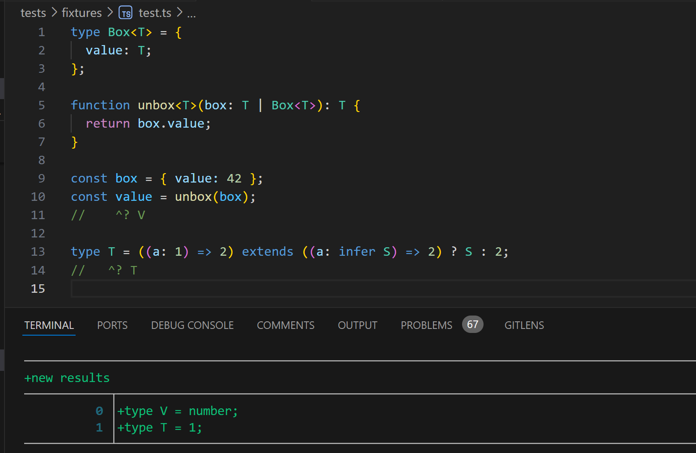

# simple_ts

\[WIP\] The simple way to resolve/infer TypeScript types. Written in Rust.

### Why?

There are several tries to implement TypeScript type checker in Rust. Why another one?

The main reason is that they are just too complex. For example, [stc](https://github.com/dudykr/stc) takes [2.4k LOC](https://github.com/dudykr/stc/blob/main/crates/stc_ts_file_anaalyzer/src/analyzer/expr/bin.rs) to check `BinaryExpression`.

I am working on [tree-shaker](https://github.com/KermanX/tree-shaker), and find its pattern can be used to infer TypeScript types. And after reading [_Rust-Based JavaScript Linters: Fast, But No Typed Linting Right Now_ by Josh Goldberg](https://www.joshuakgoldberg.com/blog/rust-based-javascript-linters-fast-but-no-typed-linting-right-now/#option-reimplementing-typescript-at-native-speed), I came up with the idea of copying some of tree-shaker's code and make a TypeScript type inferrer. To avoid the complexity, I will not implement type checking, but only type inference. See the goals and non-goals below.

### Goals

- Type inference implemented _within 10k LOC_
- Support [oxc's Type Aware Linting](https://github.com/oxc-project/oxc/issues/3105)
- Fast enough
- (Possibly) Fast DTS emitter without the need of `isolatedDeclarations`

### Non-goals

- Type checking
- Type hinting/LSP
- 100% TypeScript compatibility (In fact, many TypeScript behaviors are never documented)

### Status

Currently, the project is of 6k LOC.

The following TypeScript features are implemented/to be implemented:

- [x] Basic type inference
- [x] Union and intersection type
- [x] Generic type, Object type, and Tuple type
- [x] Conditional type and inference: `T extends infer U ? X : Y`
- [x] Control flow based type inference
- [x] (Partial) Generic function and inference
- [x] (Partial) Interface type
- [x] (Partial) Printing types
- [ ] Type narrowing/guards/assertions
- [ ] Enum type
- [ ] Class
- [ ] Builtin libs
- [ ] Multiple files support

For AST nodes, some are implemented and some are not.

As you can see, the hardest part (generic and it's inference and control flow analysis) is already implemented. The rest is relatively easy.

However, the remaining part still requires a lot of time and energy. As a student, I have no plans to realize it for the time being. If there are kind people who want to realize it, pwease take over this project. Thank you.
